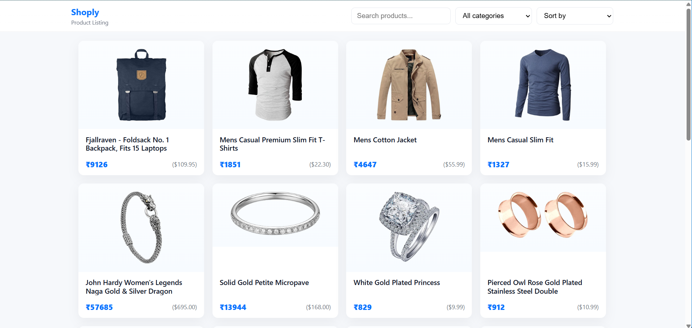
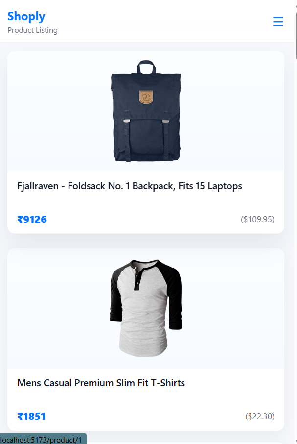
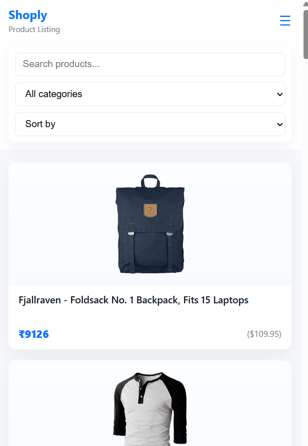
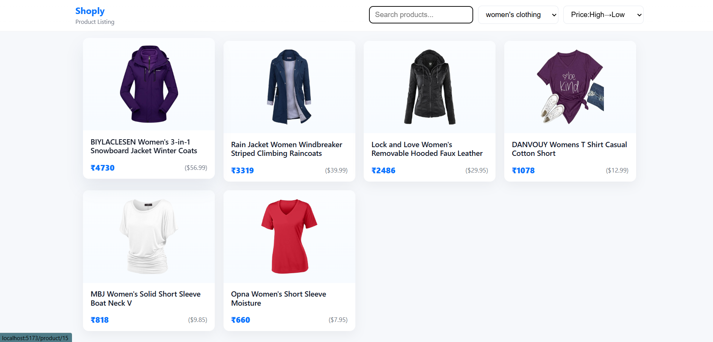
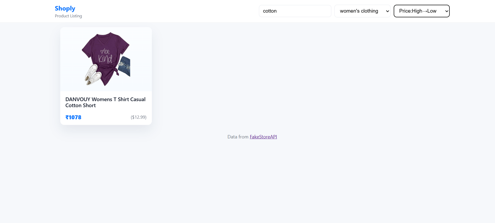
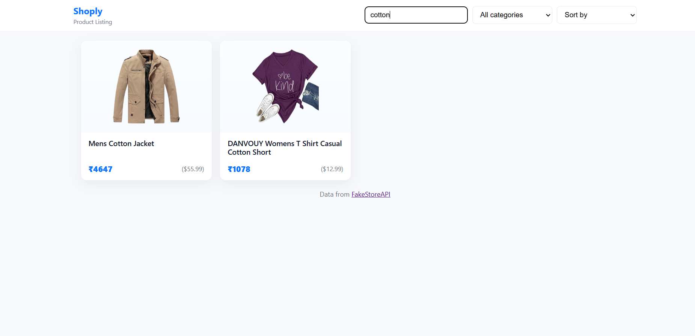
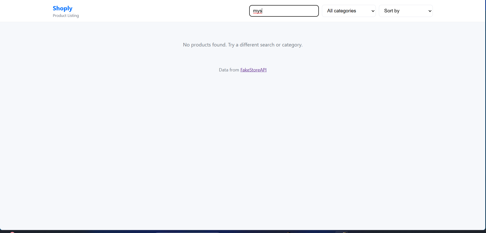
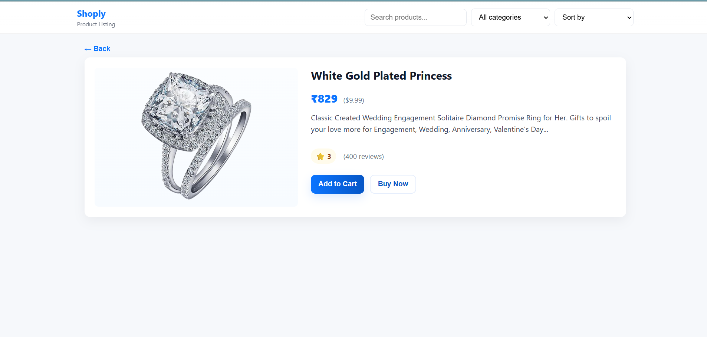

# E-Commerce Product Listing Application

##  Internship Assignment – Frontend Development

### Summary
This project is an **e-commerce product listing web application** developed using **React.js**, integrating with the **Fake Store API** to fetch real-time product data and display it in a clean, user-friendly interface.

**Features:**
- API data integration
- Dynamic search and category filtering
- Sorting functionality
- Fully responsive UI with mobile-friendly hamburger menu
- Modular, reusable React components

---

## Methodology

### Step 1 – Project Setup
- Chose **Vite** for quick and optimized React setup.
- Installed dependencies:
  - `react-router-dom` for routing
  - Basic CSS for custom styles

### Step 2 – Fetching Product Data
- Used `fetch()` to get data from [FakeStoreAPI](https://fakestoreapi.com/products)
- Stored the data in React state using `useState` and rendered using `.map()`

### Step 3 – Rendering Products
- Created reusable **ProductCard** component for:
  - Product image
  - Title
  - Price
- Used **CSS Grid** for desktop and mobile responsiveness

### Step 4 – Search Filter
- Controlled `<input>` for real-time filtering of products by title
- Used `toLowerCase()` for case-insensitive search

### Step 5 – Category Filter
- Retrieved categories from API
- Dropdown menu to filter products by selected category

### Step 6 – Sorting Options
- Sorting implemented:
  - Price: Low → High
  - Price: High → Low
  - Alphabetical (A–Z)
- Used `.sort()` before rendering

### Step 7 – Responsive Design
- Mobile-first approach using CSS media queries
- Hamburger menu to toggle filters on mobile
- Grid layout:
  - 4 columns on desktop
  - 2 columns on tablets
  - 1 column on mobile

---

## 🛠 Technical Explanation

### Components
- **App.jsx** – Main routing & layout
- **Home.jsx** – Fetches products and manages search/filter/sort
- **ProductCard.jsx** – Displays each product
- **Topbar.jsx** – Brand name, search, filters, hamburger menu
- **ProductDetail.jsx** – Detailed product view

### State Management
Used React Hooks:
- `useState` – For storing product data, search query, selected category, sorting, mobile menu toggle
- `useEffect` – For fetching data from API

### Styling
- **CSS Variables** for theme:
```css
:root {
  --accent: #0b74ff;
  --bg: #f6f8fb;
  --card: #ffffff;
}
````

* **Media Queries**:

```css
@media (max-width: 768px) { ... }
@media (max-width: 420px) { ... }
```

* **Flexbox** for aligning logo & hamburger icon
* **CSS Grid** for product layout

### API Handling

```javascript
useEffect(() => {
  const fetchProducts = async () => {
    const res = await fetch('https://fakestoreapi.com/products');
    const data = await res.json();
    setProducts(data);
  };
  fetchProducts();
}, []);
```

### Responsiveness

* Logo & hamburger in same row on mobile
* Filters hidden by default on mobile, toggled by hamburger menu

---

## 📷 Screenshots

*(Add your actual screenshots here)*

###1. Home Page – Desktop View

###2. Home Page – Mobile View 


###3. Category Filter Applied


###4. Search in Action


###5. Product Detail Page


---

##References

* [Fake Store API](https://fakestoreapi.com/)
* [React.js Documentation](https://react.dev/)
* [MDN CSS Media Queries](https://developer.mozilla.org/en-US/docs/Web/CSS/Media_Queries/Using_media_queries)
* [Flexbox & Grid Layout – MDN](https://developer.mozilla.org/en-US/docs/Web/CSS/CSS_Grid_Layout)

---

---

##  Author

**Chowdam Tarun Kumar**
Frontend Developer | React.js Enthusiast

```
